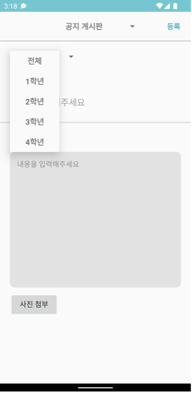

# 📱 띵동

## 목차

  

# 📍 프로젝트 소개

### 같은 학과 학생들끼리 정보를 공유하고 학과 공지사항을 확인할 수 있는 “**우리 학과만의 커뮤니티 앱**”

 

## 프로젝트 개발 배경
학생회 친구들이 학우들을 위한 설문조사, 회의록, 결산안, 학회비 납부 여부 등을 효율적으로 관리하고 공지하는 데 불편함을 느껴 이를 해결하고자 커뮤니티 앱을 개발하게 되었습니다. 또, 기존의 단체 톡방에서는 공지와 사적인 대화가 섞이는 문제가 있어 중요한 공지가 묻히는 문제가 있었습니다. 이 앱은 같은 학과 학생들이 효율적으로 소통하고 정보를 공유할 수 있는 공간을 제공합니다.

## 기대 효과 
- 과대 및 학회의 업무 간소화. (ex. 굳이 공지를 과대에게 전달하고 과대가 다시 톡방에 공지할 필요없이 앱으로 공개범위를 설정하여 한번에 공지할 수 있다.) 
- 학교 북카페에서 잘 팔지 않는 컴퓨터소프트웨어학과 교재가 중고로 많이 거래될 수 있다.
- 학과 학생들끼리의 정보 공유가 적극적으로 일어날 수 있다. 

 

## 사용 기술 및 개발 환경
- 개발일정 : 2022.03 ~ 2022.06
- 참여도 : 100% (개인)

| 구분                     | 내용                             |
|------------------------|--------------------------------|
| Backend    | Kotlin                    |
| Frontend    | xml                    |
| Database                 | Firebase Realtime Database    |
| Application development platform | Firebase                         |
| Developer Tools          | Android Studio                |

  

# 📍 주요 기능
### 핵심 기능
- 학교 및 학과 인증
- 사용자별 권한 설정 (일반, 학생회, 최상위 관리자)
- 게시판 및 게시글: 권한에 따른 공개범위 설정
- 투표 참여 및 투표 결과확인하기

### 기본 기능
- 로그인 및 회원가입
- 게시판 글쓰기, 댓글 달기

### 부가 기능
- 북마크
- 관리자 페이지
- 관리자의 회원가입 승인, 학생회 권한 승인
- 개인정보 수정 (닉네임)

  

# 📍 프로젝트 설계 구조

 

## 클래스 및 폴더 구조
| admin       |                                              |
|------------------------|--------------------------------------------------|
| ApproveCouncilActivity | 학생회 권한 승인                                 |
| ApproveMemberActivity  | 회원가입 승인                                    |
| MemberLVAdpapter       | 리스튜뷰 어댑터                                  |
| MemberModel            | 회원가입 승인 또는 학생회 승인을 요청한 사용자의 정보를 담고 있는 모델 |

| auth        |                    |
|------------------------|--------------------------------------------------|
| IntroActivity          | 첫 화면(로그인, 회원가입 선택)                   |
| JoinActivity           | 회원가입                                         |
| LoginActivity          | 로그인                                           |
| UserModel              | 사용자의 정보를 담고 있는 모델                   |

| board        |                    |
|------------------------|--------------------------------------------------|
| BoardModel             | 게시글 정보를 담는 모델                          |
| BoardListActivity      | 게시판 별 게시글을 가져옴                        |
| BoardInsideActivity    | 게시글 상세 페이지                               |
| BoardEditActivity      | 게시글 수정                                      |
| BoardListLVAdapter     | 게시글 리스트뷰 어댑터                           |
| BoardWriteActivity     | 게시글 작성                                      |
| BoardNoticeListActivity| 공지게시판 리스트뷰                              |
| BookmarkModel          | 게시물 북마크                                    |

| comment        |                    |
|------------------------|--------------------------------------------------|
| CommentLVAdapter       | 댓글 리스트뷰 어댑터                             |
| CommentModel           | 댓글정보를 담는 모델                             |

| fragments        |                    |
|------------------------|--------------------------------------------------|
| HomeFragment           | 홈 화면                                          |
| WriteFragment          | 글 작성 페이지                                   |
| ListFragment           | 게시판 선택 페이지                               |
| ChatFragment           | 북마크 페이지                                    |
| UserFragment           | 사용자 페이지                                    |

| vote        |                    |
|------------------------|--------------------------------------------------|
| VoteModel              | 투표 정보를 담는 모델                            |
| VoteUserModel          | 투표한 사용자 정보를 담는 모델                   |
| VoteResultActivity     | 투표 결과                                        |
| VoteResultLVAdapter    | 투표결과 리스트 뷰 어댑터                        |

| setting        |                    |
|------------------------|--------------------------------------------------|
| ApplyCouncilActivity   | 학생회 권한 신청                                 |
| NicknameEditActivity   | 닉네임 수정                                      |
| SettingActivity        | 로그아웃                                         |

| utils        |                    |
|------------------------|--------------------------------------------------|
| FBAuth                 | 인증에 관해 데이터베이스를 불러옴                |
| FBRef                  | 기타 데이터베이스를 불러옴                       |

 

## 데이터베이스 구조 

  

# 📍 세부 구현 내용 / 동작 화면

### 스플래시, 인트로 화면 
| splash  | intro         |
| ------- | ------------ |
|  | |

 

### 로그인, 회원가입 
| login  | sign up        |
| ------- | ------------ |
|  | |

 

### 학교 및 학과 인증

| 관리자가 새 회원을 승인  |   |   |
| ------- | ------- | -------- |
|  | | |

#### 권한
-	nonmember : 회원가입 승인 받기 전의 단계
-	user : 회원가입 승인 받은 후, 대부분의 사용자는 user권한을 갖는다. 
공지게시판 쓰기 불가능, 학생회 게시판 사용 불가능
-	council : 학생회 학생들, 사용자가 학생회 권한 신청을 한 뒤 관리자가 승인해주어야 함. (경로 : 마이페이지 > 학생회 권한 신청)
공지 게시판과 학생회 게시판 모두 사용가능하다.
-	admin : 최상위 관리자. 회원가입과 학생회 권한을 승인할 수 있다. (경로 : 마이페이지 > 기타) 공지 게시판 사용가능, 학생회 게시판 사용 불가능

 

### 메인 화면
| main  | website  | navigation bar  |
| ------- | ------- | -------- |
|  | | |

 

### 게시판
| 일반 사용자 | 학생회 권한 사용자        |
| ------- | ------------ |
|  | |

| 게시글 목록 | 게시글 상세  |
| ------- | ------------ |
|  | |

 

### 게시물 작성
| 게시물 작성 페이지  | 게시판 선택 가능  | 사진 첨부 가능  |
| ------- | ------- | -------- |
|  | | |

 

### 공지 게시판 / 공지글 작성
| 공지 게시판  | 학년별 공지가 나뉨 |   |
| ------- | ------- | -------- |
|  | | |

| 공지글 작성 | 공지 범위 설정  |
| ------- | ------------ |
|  | |

 

### 게시물 수정 및 삭제
|  |    |
| ------- | ------------ |
|  | |

 

### 북마크

 

### 투표하기 
| 투표 게시물  | 투표 결과 확인 | 투표 생성 |
| ------- | ------- | -------- |
|  | |  |

 

### 사용자 / 관리자 페이지
| 사용자 페이지  | 닉네임 변경 | 학생회 권한 신청 |
| ------- | ------- | -------- |
|  | |  |

| 관리자 로그인  | 관리자 페이지 | 새 회원 승인 |
| ------- | ------- | -------- |
|  | |     |

 
